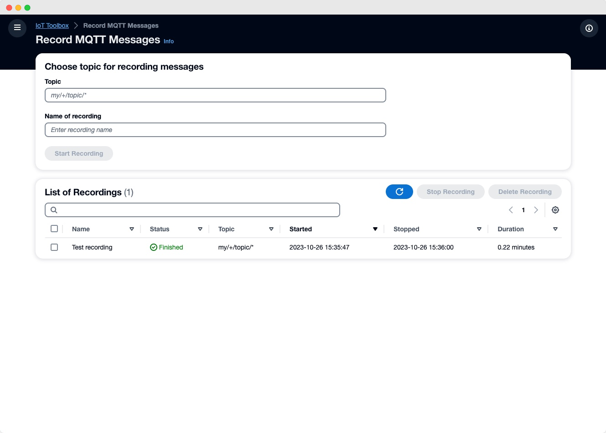
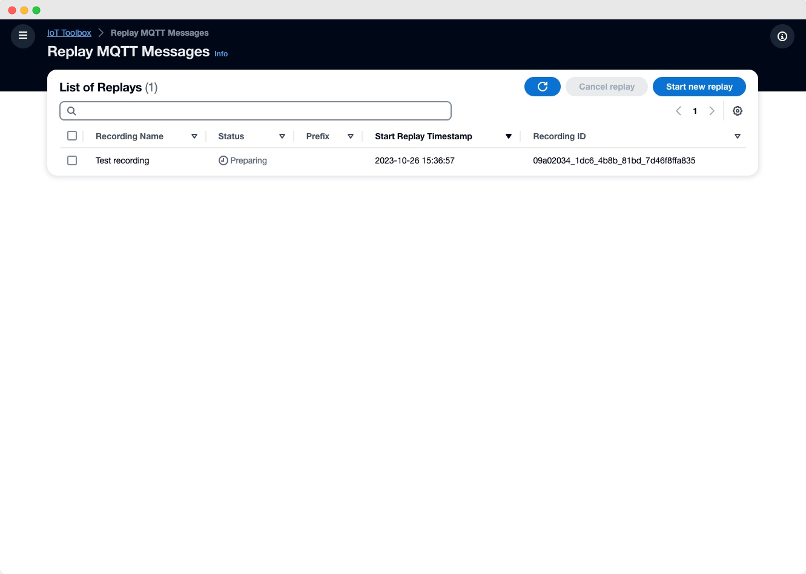
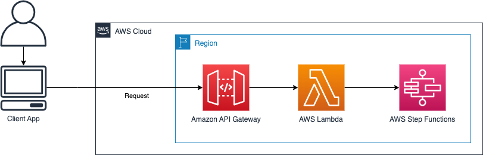
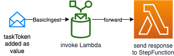
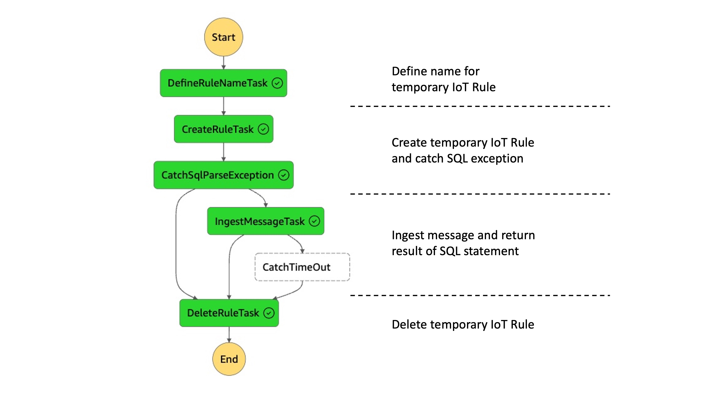
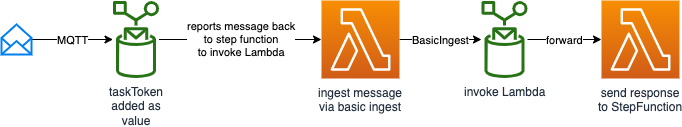
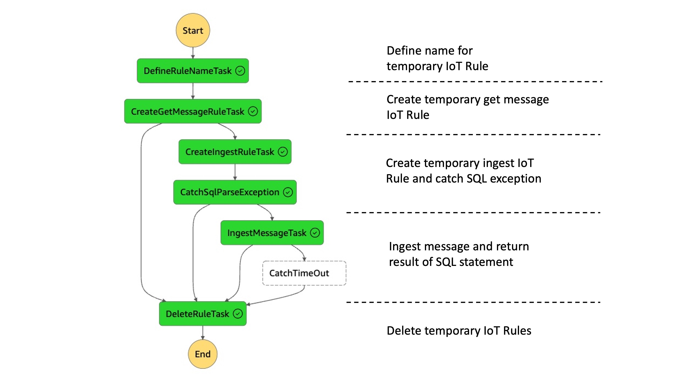
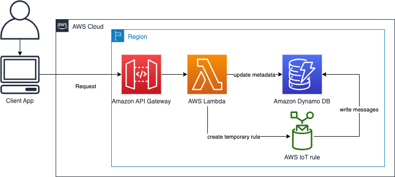
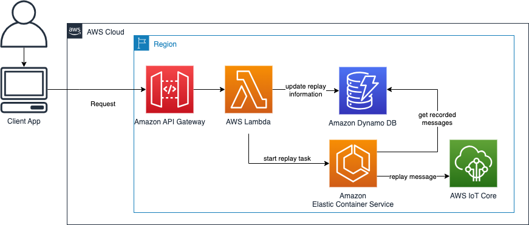

# Toolbox for AWS IoT

Toolbox for AWS IoT streamlines the process of developing IoT applications. It provides a graphical user interface designed to support developing for IoT on AWS. The CDK stack in this repository deploys the frontend and all necessary infrastructure on AWS. The solution uses serverless services to provide the necessary backend infrastructure. Read the readme for each feature get more information. 

> **Warning**
> This example is for experimental purposes only and is not production ready. The deployment of this sample can incur costs. Please ensure to remove infrastructure via the provided commands when not needed anymore.

<div align="center">
<a href="http://www.youtube.com/watch?feature=player_embedded&v=gXf468OqETk
" target="_blank"></a> 
    
Video on the AWS IoT YouTube Channel explaining the Toolbox for AWS IoT
</div>

## Features

Toolbox for AWS IoT has two key features. The testing of SQL statements of Rules for AWS IoT and the recording and replaying of messages of AWS IoT Core.

### Test IoT SQL statement 
<p float="left">
    
</p>
Toolbox for AWS IoT offers developers a reliable way to validate and optimize IoT SQL statements. Without the heavy lifting of creating and configuring IoT Rules and necessary infrastructure to test if the output is as desired. You can choose from two different options as input: 

1) Custom message - provide a sample message to retrieve the output of the IoT SQL statement 
2) Topic message - subscribes to a topic and test the first incoming message. 

The result of the IoT SQL statement is than displayed next to the provided input.

> If you intend to use [IoT functions](https://docs.aws.amazon.com/iot/latest/developerguide/iot-sql-functions.html) which require to pass an ARN of an IAM role via the Toolbox please see the section on [AWS IoT Rule functions which call other AWS services](#aws-iot-rule-sql-functions) and if you intend to invoke a Lambda function as part of your IoT SQL statement see section [AWS IoT Rule functions which invoke Lambda functions](#aws-iot-rule-sql-lambda) 
### Record and replay messages
<p float="left">
  
  
</p>
Recording and replaying messages allows for end-to-end testing of applications in development. Toolbox for AWS IoT records, saves and replays MQTT messages. The replay functionality replays the messages on demand in the same timely order either on the same topic(s) or with an added prefix. Each recording consists of a name, timestamps and the recorded topics. Previous recordings can be either started at the same time or one after the other

## How to use Toolbox for AWS IoT

After completing the [Prerequisites](#prerequisites) and [Getting started](#getting-started) you can start using the Toolbox for AWS IoT. Open the frontend link of the CDK output. A password was sent to the provided email address during deployment.

### Prerequisites

Before installing this sample, make sure you have the following installed:

1. [AWS CLI](https://aws.amazon.com/cli/)  
2. [Docker](https://docs.docker.com/get-docker/) 
3. [AWS CDK v2](https://docs.aws.amazon.com/cdk/v2/guide/getting_started.html#getting_started_install) 
4. [Configure your AWS CLI](https://docs.aws.amazon.com/cli/latest/userguide/cli-configure-quickstart.html) 
5. [Bootstrap AWS CDK in your target account](https://docs.aws.amazon.com/cdk/v2/guide/getting_started.html#getting_started_bootstrap) 


### Getting started

> **Note**
> This architecture creates resources that have costs associated with them. Please see the [AWS Pricing](https://aws.amazon.com/pricing/) page for details and make sure to understand the costs before deploying this stack.

After completing the prerequisites run the following commands to deploy the full solution! A user with your specified 
email address will be created in the Cognito User Pool and the temporary password will be sent to you. Deployment takes several minutes because it creates an optimized production build for the frontend and creates cloudfront distribution.
If you wish to deploy the solution without an initial user and instead create the user yourself in the Cognito User Pool,
deploy the solution without the `-c initialUserEmail=<your email address>` parameter. 

```
cd cdk
npm install
npx cdk deploy --all -c initialUserEmail=<your email address> -c region=<region>
```
> If you intend to test [IoT functions](https://docs.aws.amazon.com/iot/latest/developerguide/iot-sql-functions.html) which require to pass an ARN of an IAM role via the Toolbox please see the section on [AWS IoT Rule functions which call other AWS services](#aws-iot-rule-sql-functions) 

In case you want to deploy the solution without the frontend (e.g. while customizing the CDK stack), run
```
npx cdk deploy --all -c initialUserEmail=<your email address> -c region=<region> -c deployFrontend=false
```

To run the integration tests
```
npm run integ-test
```
## How the application works 

The frontend is a single page application hosted in a [Amazon S3](https://aws.amazon.com/s3/) bucket via [Amazon Cloudfront](https://aws.amazon.com/cloudfront/). 


### How Test IoT SQL statement works

You have two options to provide input to your SQL statement:

1) Custom message - provide a sample message to retrieve the output of the IoT SQL statement.
2) Topic message - subscribes to a topic and test the first incoming message. 

All requests are synchronous and targeted towards [Amazon API Gateway](https://aws.amazon.com/api-gateway/). The API Gateway invokes a [AWS Lambda](https://aws.amazon.com/lambda/) which invokes the correct [AWS Step Function](https://aws.amazon.com/step-functions/) state machine. Details of each Step Function per feature are listed below.



### Custom message
The flow for the custom message is orchestrated via AWS Step Functions. The custom message including a task token is ingested to a temporary IoT rule with the SQL statement which sends the result to an AWS Lambda function. The Lambda returns the result back to the AWS Step Function and sends a task success.



The AWS Step Function creates the necessary infrastructure and deletes it afterwards. The flow is the following:

1. Define name for temporary IoT Rule
2. Create temporary IoT Rule which is created using the test SQL statement. The statement excludes the WHERE clause to avoid an unintended invocation.
3. Catch SQL exception if the SQL statement is malformed
4. Ingests a message via basic ingest to the rule. The message contains a task token as value. The result is forward to a receiving Lambda which forwards the token back to Step Function and reports a success.
5. Report timeout if no output is received.
6. Delete temporary IoT rule.




### Topic message
The flow for topic message is orchestrated via AWS Step Functions. An IoT Rule is created to get the first incoming message on the topic in the SQL statement. The rule adds a task token as value. If a message is received it is ingested into an IoT rule which contains the SQL statement which is to be tested. The rule forwards the output to a AWS Lambda function. The AWS Lambda function returns the result back to the AWS Step Function and sends a task success.



The AWS Step Function creates the necessary infrastructure and deletes it afterwards. The flow is the following:


1. Define name for temporary IoT Rules
2. Create temporary IoT Rules. The get message rule to fetch the first message incoming the to topic specified in the WHERE clause in the IoT SQL test statement. This rule includes the task token as user property. 
3. If no message is received for this topic the state triggers a timeout.
4. Next, the ingest message rule is created. This rule contains the SQL statement excluding the WHERE clause and forwards the task token. The result message is forwarded to a Lambda which sends a task success back to the step function.
3. Catch SQL exception if the SQL statement is malformed.
4. Ingests a message via basic ingest to the rule. The message contains the task token as value. The result is forward to a receiving Lambda which sends the token back to Step Function and reports a task success.
5. Report timeout if no output is received.
6. Delete temporary IoT rules.



### How Record and replay messages works
You can record MQTT messages and replay them. All requests are synchronous and targeted towards an Amazon API Gateway. The Amazon API Gateway invokes the corresponding Lambda.

#### Record messages
The user sends a request to an Amazon API Gateway which invokes a AWS Lambda function. The AWS Lambda writes the metadata information (name, topic, ...) to a Amazon Dynamo DB table. Next, the AWS Lambda function creates the temporary IoT rule which stores all incoming messages on the specified topic in a Amazon Dynamo DB table.



With a separate request the user can stop the recording. This deletes the IoT rule and completes the metadata fields like start/stop time in the Amazon Dynamo DB table.

#### Replay messages

To start a replay the user defines the recording(s) and if desired a topic prefix. An AWS Lambda function starts an Amazon ECS Fargate task. This task gets all information about the recording(s) from the table, gets the messages which belong to the recording(s) and replays them in the same timely order to IoT core.



The replay task automatically stops if all messages are replayed, but can be manually cancelled from the user via an API call.

#### Technical details

The record and replay functionality saves the information in three different Amazon Dynamo DB tables:

**Metadata** - stores the metadata information about a recording

| recordingId (Partition key) | createdAt | recordingName | status                                                                                    | topic            |
| :-------------------------- | --------: | ------------: | ----------------------------------------------------------------------------------------: | ---------------: |
| unique ID                   | timestamp | given name    | PREPARING <br /> IN_PROGRESS <br /> FINISHED <br /> ABORTED <br /> FAILED <br /> DELETING | recorded topic(s)|


**Recording** - contains the recorded messages

| recordingId (Partition key) | timestamp (Sort key) | message        | mqttProperties          | topic            | userProperties          |
| :-------------------------- | -------------------: | -------------: | ----------------------: | ---------------: | ----------------------: |
| unique ID                   | timestamp            | message content| message mqtt properties | message topic    | message user properties |


**Replay history** - contains the replay history of records

| recordingId (Partition key) | replayId (Sort key)  | recordingName        | status                                                                                    | taskId          | topicPrefix             |
| :-------------------------- | -------------------: | -------------------: | ----------------------------------------------------------------------------------------: | --------------: | ----------------------: |
| unique ID                   | timestamp            | given name           | PREPARING <br /> IN_PROGRESS <br /> FINISHED <br /> ABORTED <br /> FAILED <br /> DELETING | ID of ECS task  | topic prefix for replay |

## Security

> **Warning**
This application was written for demonstration and educational purposes and not for production use. The [Security Pillar of the AWS Well-Architected Framework](https://docs.aws.amazon.com/wellarchitected/latest/security-pillar/welcome.html) can support you in further adopting the sample into a production deployment in addition to your own established processes. Take note of the following:

- The application uses encryption in transit and at rest with AWS-managed keys where applicable. Optionally, use [AWS KMS](https://aws.amazon.com/kms/) with [DynamoDB](https://docs.aws.amazon.com/kms/latest/developerguide/services-dynamodb.html), [CloudWatch](https://docs.aws.amazon.com/en_en/AmazonCloudWatch/latest/logs/encrypt-log-data-kms.html), and [S3](https://docs.aws.amazon.com/kms/latest/developerguide/services-s3.html) for more control over encryption keys.

- This application uses [Powertools for AWS Lambda (Python)](https://github.com/aws-powertools/powertools-lambda-python) to log to inputs and outputs to CloudWatch Logs. Per default, this can include sensitive data contained in user input. Adjust the log level and remove log statements to fit your security requirements.

- In order to simplify the setup of the demo, this solution uses AWS managed policies associated to IAM roles that contain wildcards on resources. Please consider to further scope down the policies as you see fit according to your needs. 

- If your security controls require inspecting network traffic, consider to attach the Lambda functions to a VPC via its [`VpcConfig`](https://docs.aws.amazon.com/AWSCloudFormation/latest/UserGuide/aws-properties-lambda-function-vpcconfig.html).

> **Note**
Even though we provide the Toolbox for AWS IoT as a sample which is not intended for production usage, it is deployed on public endpoints. Therefore, by default the CDK stack will deploy the following security-related configurations as well.


In case you already have controls in place (e.g. AWS WAF), your organizations policies restrict which types of resources you are allowed to create, or you want to reduce cost, each control can be disabled. To disable a control, either
 - set the respective CDK context variable in [cdk.json](cdk/cdk.json) to `false`
 - pass the context variable on the command line when deploying, e.g. `npx cdk deploy --all -c initialUserEmail=<your email address> -c enableApiLogging=false`
 - set the respective environment variable to false before deploying the stack, e.g. `export TOOLBOX_ENABLE_API_LOGGING=false`

> **_NOTE:_**  AWS WAF for CloudFront requires creation of the WebACL in the _us-east-1_ region. Many customers restrict which regions are usable. To enable a hassle-free deployment we therefore decided to not deploy AWS WAF for CloudFront by default but recommend to do so.  

| Control                        | Description                                                                                | Enabled by default | CDK context variable      | Environment variable                | Further information                                                                                                                                |      
|--------------------------------|--------------------------------------------------------------------------------------------|--------------------|---------------------------|-------------------------------------|----------------------------------------------------------------------------------------------------------------------------------------------------|
| Amazon API Gateway Access Logs | Logs all API Gateway Requests to CloudWatch                                                | ✅                  | `enableApiLogging`        | `TOOLBOX_ENABLE_API_LOGGING`        | [API Gateway access logging](https://docs.aws.amazon.com/apigateway/latest/developerguide/set-up-logging.html#set-up-access-logging-using-console) |
| Amazon CloudFront Access Logs  | Logs all Cloudfront Requests to an S3 bucket                                               | ✅                  | `enableCloudFrontLogging` | `TOOLBOX_ENABLE_CLOUDFRONT_LOGGING` | [CloudFront access logging](https://docs.aws.amazon.com/en_en/AmazonCloudFront/latest/DeveloperGuide/AccessLogs.html)                              |
| Amazon S3 Access Logs          | Logs all requests to the SPA and CloudFront access logs bucket to a separate bucket        | ✅                  | `enableS3Logging`         | `TOOLBOX_ENABLE_S3_LOGGING`         | [S3 access logging](https://docs.aws.amazon.com/AWSCloudFormation/latest/UserGuide/aws-properties-s3-bucket-loggingconfig.html)                    |
| Amazon VPC Flow Logs           | Logs all VPC traffic of the message replay cluster VPC to CloudWatch                       | ✅                  | `enableVpcLogging`        | `TOOLBOX_ENABLE_VPC_LOGGING`        | [VPC Flow logs](https://docs.aws.amazon.com/en_en/vpc/latest/userguide/flow-logs.html)                                                             |
| AWS WAF                        | Enables WAF with the Common Rule Set and the IP Reputation List on API Gateway and Cognito | ✅                  | `enableWAF`               | `TOOLBOX_ENABLE_WAF`                | [AWS WAF](https://docs.aws.amazon.com/en_en/waf/latest/developerguide/waf-chapter.html)                                                            |
| AWS WAF - CloudFront           | Enables WAF with the Common Rule Set and the IP Reputation List on CloudFront              | ❌                  | `enableCloudFrontWAF`     | `TOOLBOX_ENABLE_CLOUDFRONT_WAF`     | [AWS WAF](https://docs.aws.amazon.com/en_en/waf/latest/developerguide/waf-chapter.html)                                                            |

### AWS IoT Rule SQL functions
AWS IoT Rule SQL provides several [functions](https://docs.aws.amazon.com/iot/latest/developerguide/iot-sql-functions.html) which allow you to retrieve data from other AWS services, such as `get_thing_shadow` or `get_dyanmodb`.
These functions expect the ARN of an IAM role, which grants the rules engine permission to invoke the service, as a parameter. For example,
for `get_dynamodb` you need to provide a role which allows `dynamodb:GetItem`. For security reasons the Toolbox for AWS IoT cannot
create the those roles itself during deployment as the permission scope would be too broad. 

If you want to use those functions you need to create the respective roles and provide their ARNs during deployment time of the Toolbox for AWS IoT.
To do this, 
- create an IAM role which can be assumed by AWS IoT and contains the required permissions (see the example below)
- (re-)deploy the Toolbox for AWS IoT with the role ARN(s) passed as parameter, separated by a comma:
  ```
  npx cdk deploy --all -c initialUserEmail=<your email address> -c region=<region> -c ruleRoleArns=arn:aws:iam::<account-id>:role/<role1>,arn:aws:iam::<account-id>:role/<role2>
  ```

Here is an example policy and trust policy which allows the rules engine to query for thing shadows

_Trust policy_
```json
{
    "Version": "2012-10-17",
    "Statement": [
        {
            "Sid": "",
            "Effect": "Allow",
            "Principal": {
                "Service": "iot.amazonaws.com"
            },
            "Action": "sts:AssumeRole"
        }
    ]
}
```
_Permission policy_
```json
{
  "Version": "2012-10-17",
  "Statement": [
    {
      "Sid": "Statement1",
      "Effect": "Allow",
      "Action": [
        "iot:GetThingShadow"
      ],
      "Resource": [
        "*"
      ]
    }
  ]
}
```

### AWS IoT Rule SQL Lambda
AWS IoT can invoke a Lambda function on the MQTT message for advanced processing. If you want to invoke a Lambda function, you must grant AWS IoT `lambda:InvokeFunction` permissions to invoke the specified Lambda function. As part of each IoT SQL statements test run the Toolbox creates a temporary IoT rule with the name prefix `iottoolbox_ingest_` followed by a unique id. The IoT rule needs to be referenced as source ARN as part of the permission policy of the Lambda function. The [documentation how to call a Lambda function](https://docs.aws.amazon.com/iot/latest/developerguide/iot-sql-functions.html#iot-func-aws-lambda) shows a more detailed overview.

Here is an example to how to grant the `lambda:InvokeFunction` permission using the AWS CLI:
```
aws lambda add-permission --function-name "function_name"
--region "region"
--principal iot.amazonaws.com 
--source-arn arn:aws:iot:eu-central-1:account_id:rule/iottoolbox_ingest_*
--source-account "account_id"
--statement-id "unique_id" 
--action "lambda:InvokeFunction"
```

## Cleanup
1) Empty the Amazon S3 bucket created as part of the CDK stack.
2) Run `npx cdk destroy` to cleanup all related resources in your account. 
3) Delete DynamoDB tables manually

## Contributing

See [CONTRIBUTING](CONTRIBUTING.md#security-issue-notifications) for more information.

## License
This library is licensed under the Apache 2.0 License. See the [LICENSE](LICENSE) file.
